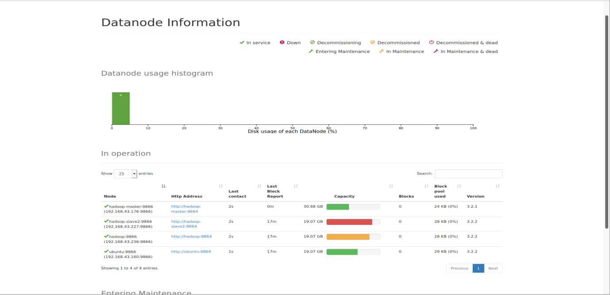
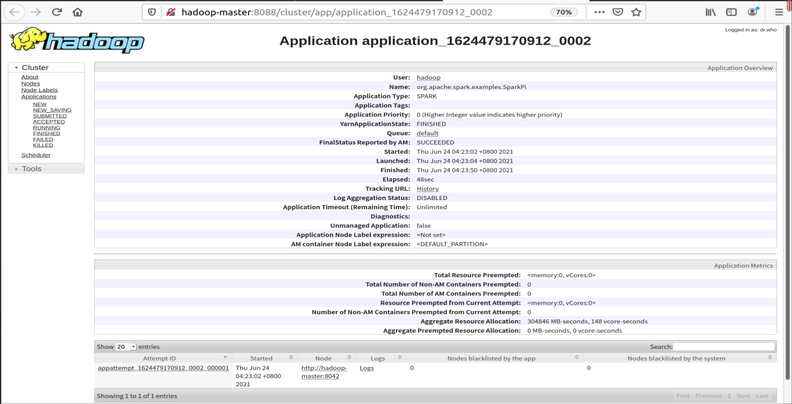
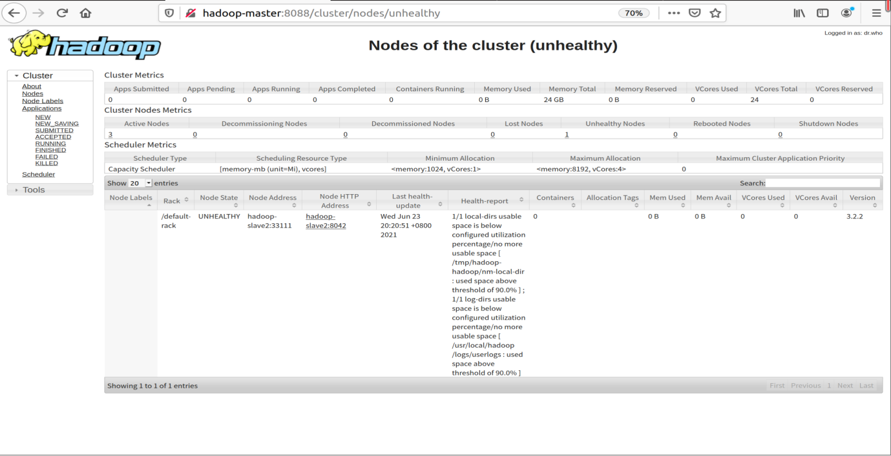

<div style="width:60%;height:200px;text-align:center;border:14px solid #808080;border-top:none;border-left:none;border-bottom:none;display:inline-block">
    <div style="border:4px solid #808080;border-radius:8px;width:95%;height:100%;background-color: rgb(209, 209, 209);">
        <div style="width:100%;height:30%;text-align:center;line-height:60px;font-size:26px;font-family:'Lucida Sans', 'Lucida Sans Regular', 'Lucida Grande', 'Lucida Sans Unicode', Geneva, Verdana, sans-serif;">VE472 Lab Report</div>
        <div style="width:100%;height:18%;text-align:center;line-height:26px;font-size:20px;font-familny:'Lucida Sans', 'Lucida Sans Regular', 'Lucida Grande', 'Lucida Sans Unicode', Geneva, Verdana, sans-serif;"><b>Lab 4</b> - Summer 2021</div>
        <div style="width:100%;height:57%;text-align:center;font-size:16px;line-height:22px;font-family: 'Courier New', Courier, monospace;font-weight:300;"><br><b>Name: Mingxuan Lu<br>ID: 518021911166<br>Email: mingxuan.lu@sjtu.edu.cn<br></b></div>
    </div>
</div>
<div style="width:35%;height:200px;display:inline-block;float:right">
    <div style="width:100%;height:25%;text-align:center;line-height:55px;font-size:20px;font-family:'Lucida Sans', 'Lucida Sans Regular', 'Lucida Grande', 'Lucida Sans Unicode', Geneva, Verdana, sans-serif;"><b>Table of Contents</b></div>
    <div style="width:100%;height:75%;text-align:left;margin-left:2px;line-height:30px;font-size:13px;font-family:Verdana, Geneva, Tahoma, sans-serif;font-weight:300;">• Drill and Spark Installation<br>• Simple Drill Queries<br>• Simple Spark</div>
</div>

## Ex. 1 Drill and Spark Installation

Our group has 4 members. Following instructions, we successfully set up our Hadoop cluster.



Then we successfully set up Yarn, Drill and Spark in our cluster.

Once we find out that one of our nodes is unhealthy, but the whole cluster is still running, which proves the fault capacity of the hadoop cluster. Later we find that it is because the node has reached its capacity(since we are running the applications on virtual machines, the capacity is very limited). After we give more storage to the node, it turns back to healthy.

## 



## Ex.2 Simple Drill Queries

We first generate a large file with students and their grades.

```python
import random

firstnames = []
for line in open("firstnames.txt"):
    firstnames.append(line.strip())

lastnames = []
for line in open("lastnames.txt"):
    lastnames.append(line.strip())

for fileNum in range(0, 1):
    fileName = "mapper" + str(fileNum) + ".csv"
    names = []
    IDs = []
    f = open(fileName, "w")
    for i in range(0, 100000):  # total number of students is 100000
        ID = ""
        for x in range(0, 10):
            digit = random.randint(0, 9)
            ID = ID + (str(digit))

        names.append(random.choice(firstnames) + " " + random.choice(lastnames))
        IDs.append(ID)

    for j in range(0, 200000000):  # total number of lines is 200000000
        grade = random.randint(0, 100)
        index = random.randint(0, 99999)
        result = names[index] + "," + IDs[index] + "," + str(grade) + "\n"
        f.write(result)
```

Then we get a file `mapper0.csv`, which exceeds 5GB.


By running 

```bash
hdfs dfs -mkdir l4
hdfs dfs -put ./mapper0.csv l4
```

 we put the file to hdfs.

We can check `http://10.119.6.238:8047/storage` for storage plugin configuration

2. 1)student who had the lowest grade:

```sqlite
apache drill> select name, min(score) as min_score from (select columns[0] as name, INTEGER columns[2] as score from hdfs.`/user/pgroup1/l4/mapper0.csv`) group by name order by min_score asc limit 1;
+----------------+-----------+
|      name      | min_score |
+----------------+-----------+
| Dwana Harradon | 0         |
+----------------+-----------+
1 row selected (31.429 seconds)
```

​		2)student who had the highest average grade:

```sqlite
apache drill> select name, AVG(score) as avg_score from (select columns[0] as name, cast(columns[2] as int) as score from hdfs.`/user/pgroup1/l4/mapper0.csv` ) group by name order by avg_score desc limit 1;
+----------------+------------------+
|      name      |    avg_score     |
+----------------+------------------+
| Domonique Mess | 53.2076209086468 |
+----------------+------------------+
1 row selected (48.804 seconds)
```

3. median over all the scores:

```sqlite
apache drill> SELECT COUNT(*) FROM hdfs.`/user/pgroup1/l4/mapper0.csv`;
+-----------+
|  EXPR$0   |
+-----------+
| 200000000 |
+-----------+
1 row selected (22.093 seconds)
apache drill> SELECT AVG(score)
2..semicolon> FROM (SELECT cast(columns[2] as int) as score
3..........)>       FROM hdfs.`/user/pgroup1/l4/mapper0.csv`
4..........)>       ORDER BY score
5..........)>       LIMIT 2    -- odd 1, even 2
6..........)>       OFFSET 99999999)
7..semicolon> ;
+--------+
| EXPR$0 |
+--------+
| 50.0   |
+--------+
1 row selected (85.175 seconds)
```

## Ex.3 Simple Spark

(The contents below is identical to the `ex3.ipynb` file.)

```python
"""
We first run `hdfs dfs -put ./grade.csv /` to put the local file "grade.csv" into hdfs.
"""
from pyspark import SparkConf, SparkContext
sc = SparkContext.getOrCreate(SparkConf().setMaster("local[*]"))	# create an instance

# create an RDD from file
content = sc.textFile("grade.csv")

# .collect() serialize the RDD into a <list>
content.collect()

def f(x):
    a = x.split(',')
    return (a[1], int(a[2]))

mp = content.map(f)
test = mp.reduceByKey(lambda x, y: y if y>x else x)
test.collect()
"""
Check ex3_result for the result.
We don't show the result here because it's too long.
"""
```

```python
"""
flatmap() function return a serialized result without Key-Value pair structure.
"""
fm = content.flatMap(f)
fm.collect()
```

